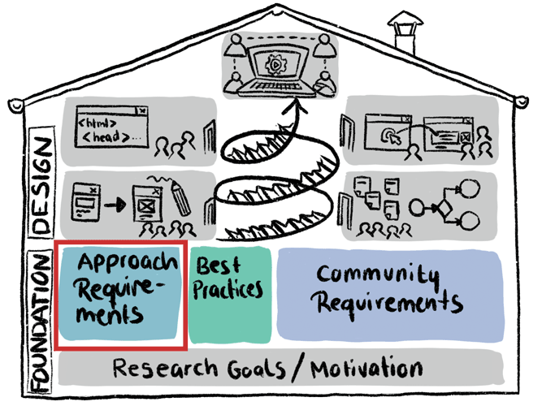

# Approach Requirements Analysis
A high-level view on the proposed solution. In this section I will try to specify the high-level requirements of my approach by addressing questions like *"Can the principles of Commons-Based Peer-Production (CBPP) be transfered to scientific research processes? And if so which dimensions are important?"*. The findings in this section are supposed to serve as an orientation and will be discussed with and adapted to the requirements to online self-research communities (more specifically, Open Humans).  
 

*TBD*

