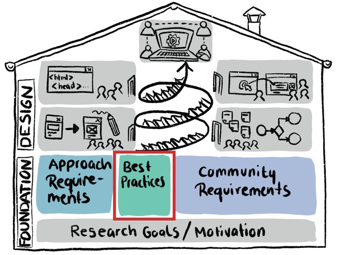

# Best Practices
What works and what doesn’t? This section is meant for the collection of features, best practices and lessons learned of peer-production platforms from citizen science and other domains.  
 

*TBD*
