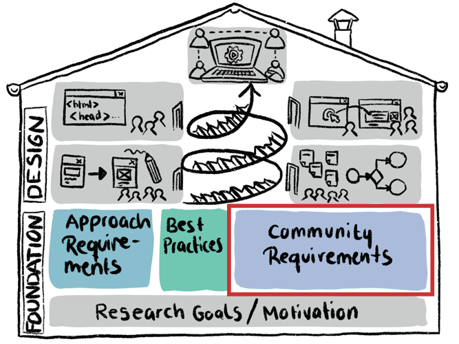

# Community Requirements Analysis
The requirements of the Open Humans community. At this stage, the analysis is rather high-level, e.g. useful features are discussed in general, but not their exact implementation. This analysis will be done via focus groups, interviews, surveys, co-design sessions etc.  
 

*TBD*

