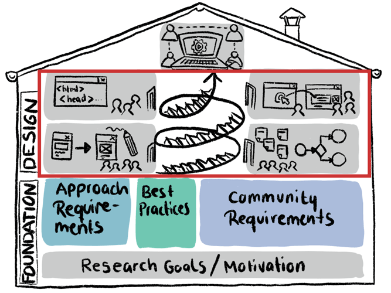

# Design Iterations
This section is meant to provide **detailed information** on **how the system solution will function**. It will be created based on the high-level requirements identified in the Approach and Community Requirements Analyses, and describes and illustrates their implementation in this particular use case in detail.  
For example, it will include detailed **functional requirements**, including e.g. **process flows, mock ups or user journeys**.   
This section will grow iteratively in a participatory user-centered way, by prototyping, testing and documenting one feature at a time.  
 

*TBD*

## Contents (amongst others)
- Sketches
- Results of codesign workshops
- ...

